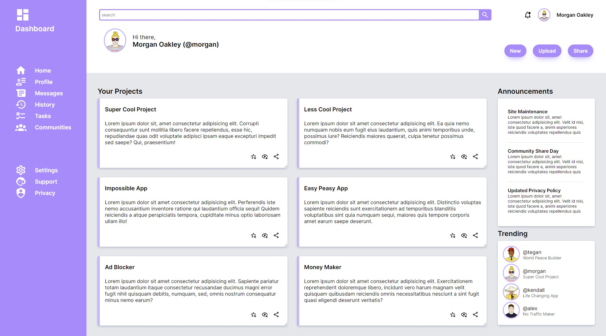

# Introduction
The objective is to recreate an admin dashboard of the provided design using only HTML and CSS.
This project features: 
- responsive project cards
- CSS grid layout
- CSS grid and flex layout

[👉Live Demo](https://bravoosonja.github.io/admin-dashboard) 

## Provided design 

## My work

# Skills used
- **HTML** the use of HTML divs for CSS grid 
- **CSS**  grid positioning
- **CSS**  combination of CSS grid and flex
# Lessons learned
- Aligning icons and text in a grid on the sidebar. Resolved by adding ```<div class="side-bar-grid"/>``` and making the ```side-bar-container``` flex. 
- Aligning Trending section and Your Projects section in a grid
  ```css
  .trending-grid {
    display: grid;
    grid-template-rows: auto 1fr 1fr;
  }
  ```
# Future plans
- [x] images with 404 issues on github demo page - updated image path
- [ ] Convert CSS units to relative
- [x] Refactor code
- [x] Update Readme
# Credit
User profile images from [joeschmoe](https://joeschmoe.io/)
